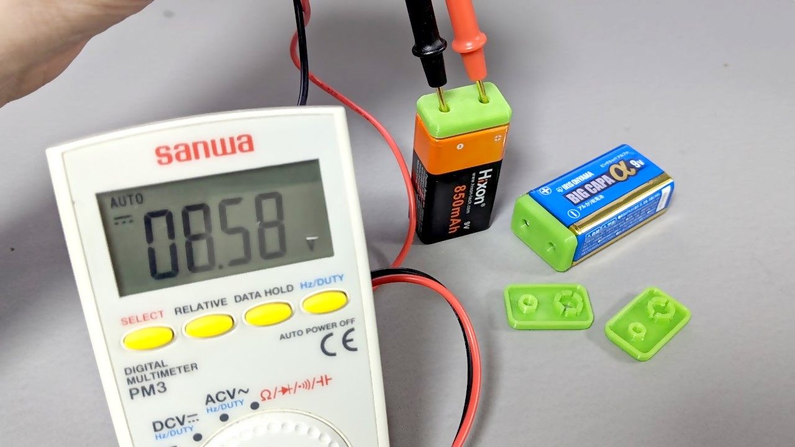

# Battery Cover for 006P/PP3/6LR61

Battery cover for 006P / PP3 / 6LR61. It covers the terminals and prevents shorts. There are holes at the position of each terminals, so you can check the voltage with the cover attached.

> [!CAUTION]
> The protrusion on the negative terminal side is fragile, so we recommend setting the infill to 100%..

## License

[CC BY-NC-SA](./LICENSE)

## Download

|Revision|Date|Download Link|
|:--:|:--:|:--|
|r1|2020/05/22|[battery-cover-006p-pp3-6lr61-r1.stl](./r1/battery-cover-006p-pp3-6lr61-r1.stl)|
