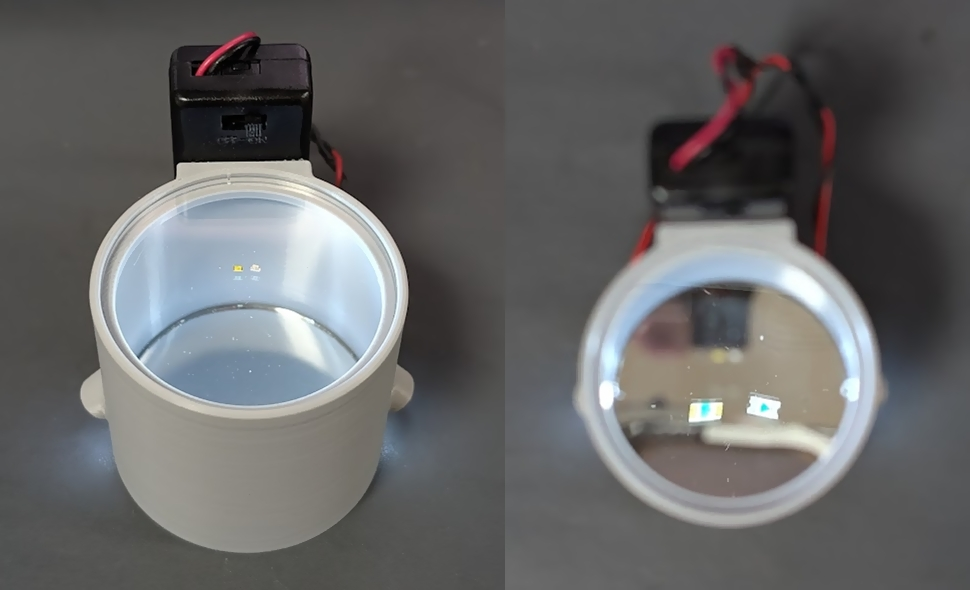
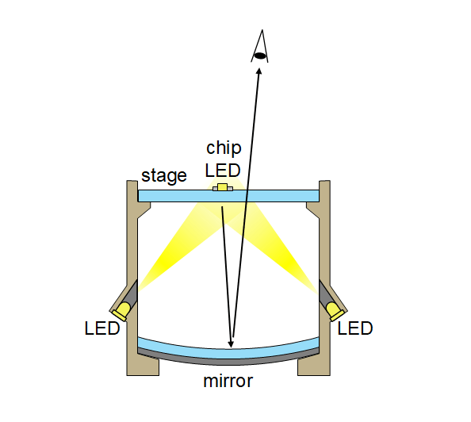

# チップ LED 極性スコープ (SMD LED Orientation Scope)

 A tool that uses a concave mirror to magnify and display the bottom-surface marker.
 Place a chip LED on the stage and look down through the top, and the bottom marker
 — illuminated from below by a white LED — appears magnified through the concave mirror.

## Parts

- 3D-printed body
- acrylic plate: [光(Hikari) アクリル板 50丸×2mm KA-500 透明](https://www.amazon.co.jp/dp/B00E84KOKU/)
- concave mirror: [PATIKIL 光学レンズ1セット 5個 両凸レンズ 両凹レンズ プリズムレンズ 凸面鏡 凹面鏡 物理実験教育用 クリア](https://www.amazon.co.jp/dp/B0CPPS94G9/)
- LED: [OSW54K3131A](https://akizukidenshi.com/catalog/g/g106410/)
- resistor: [1/6W100Ω](https://akizukidenshi.com/catalog/g/g116101/)
- battery box: [電池ボックス 単4×2本 リード線・フタ・スイッチ付](https://akizukidenshi.com/catalog/g/g100348/)

## LICENSE

[CC-BY 4.0](./LICENSE)
