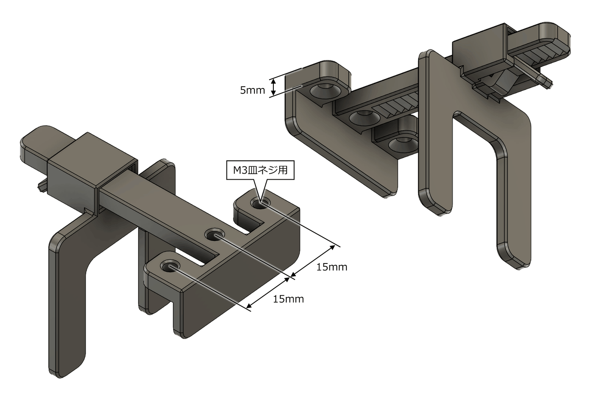

# モニタ用汎用マウント

[しんどいサイネージ用スタンド](../../special/sindoi-sign/) をモニタに固定するために作ったマウントです。穴の寸法を合わせれば他のものにも使えます。

## ライセンス

[CC BY-NC-SA](./LICENSE)

## 動画

https://github.com/user-attachments/assets/c9ef0ae3-17ed-470b-9e04-88cf2d7b9918

