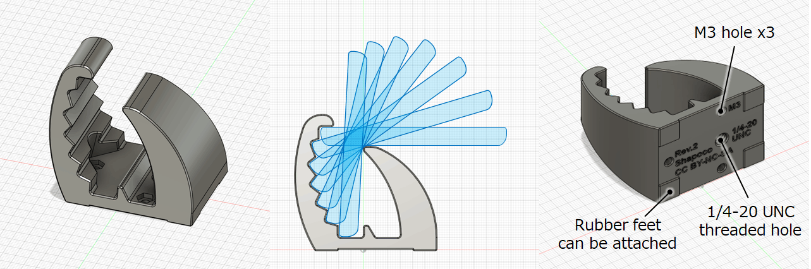
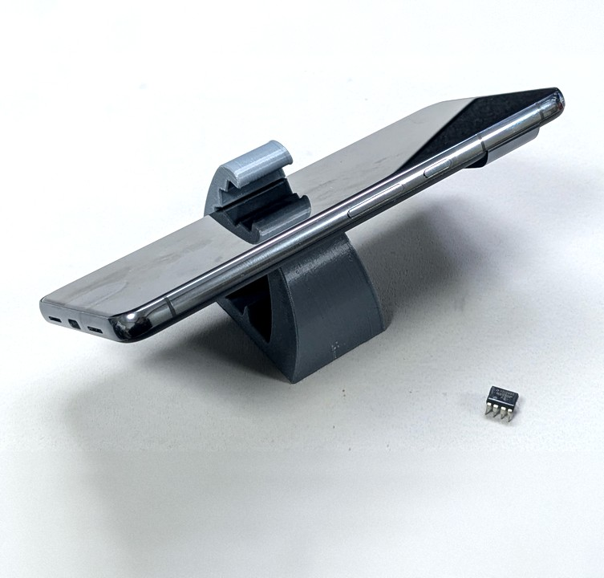
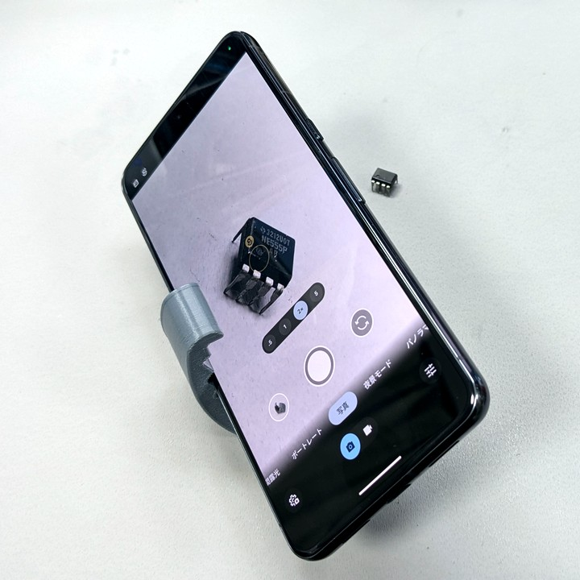
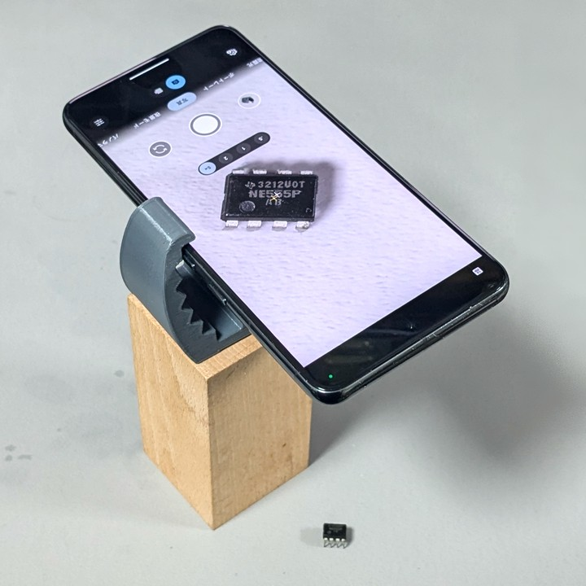
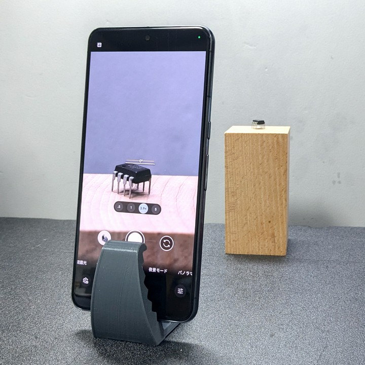
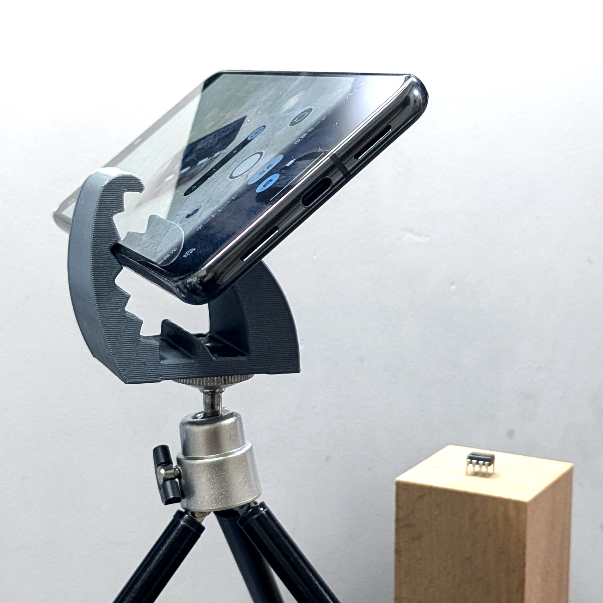

# 作業自撮り用スマホスタンド

小物や手元の作業を撮りたいときに気軽に使える簡易スマホスタンドです。

- スマホを7段階の角度で固定できます。
- 底面に 1/4-20 UNC のネジ穴があり、三脚等の雲台に固定できます。

## ライセンス

[CC BY-NC-SA](./LICENSE)

## 改版履歴

|リビジョン|説明|
|:--:|:--|
|[r1](./r1/)|初版公開|
|[r2](./r2/)|安定性の改善、雲台への取り付け対応|

## 補足

### 雲台固定用の穴について

1/4-20 UNC をベースに、3D プリント向けにトレランスを大きめにとっていますが、それでもプリントの条件によってはきつくてネジが入りにくいかもしれません。その場合は丸やすりやナイフ等で穴の内側のネジ山を削ってみてください。

### ゴム足を取り付ける場合

滑り止めのために底面の四隅にゴム足を取り付けることができますが、積層痕が残ったままだとすぐに剥がれてしまうかもしれません。ゴム足を貼り付ける前に紙やすり等で底面をツルツルにしておくことをお勧めします。

## 作例

[hono2k09](https://x.com/hono2k09/status/1990035444256710662) さん、
[むれねず](https://x.com/murenezumi/status/1989902955647246693) さん、
[なるみ](https://x.com/queenmk/status/1964912723764171105) さん、
[A.Amag](https://x.com/ame_feb4/status/1962052576461086787) さん、
[らびやん](https://x.com/lovyan03/status/1953413691329896871) さん、
[dominoTECH](https://x.com/dominodaosi106/status/1953412634335994010) さん、
[なみお](https://x.com/nyamio/status/1947229601098272905) さん、
[ほりたみゅ](https://bsky.app/profile/hyrodium.bsky.social/post/3lkwtc2dxuk2a) さん、
[kaiba](https://x.com/kaiba/status/1902588182216261970) さん、
[くろゴマ](https://x.com/chrogoma/status/1893577562544288175) さん、
[あっきぃ](https://misskey.io/notes/a4e209jp9shp09ze) さん 

## ギャラリー

    

## 関連情報

- SNS 投稿
    - [X (Twitter)](https://x.com/shapoco/status/1889340554968018978)
    - [Misskey.io](misskey.io/notes/a1bimwemphqj06be)
    - [Bluesky](https://bsky.app/profile/shapoco.net/post/3lcesafdejc2a)
