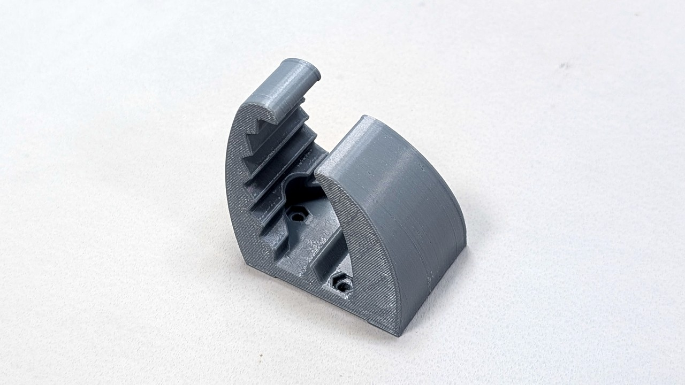
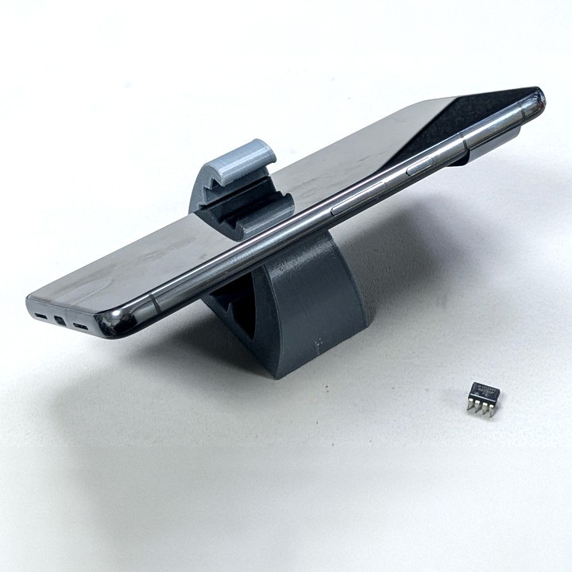
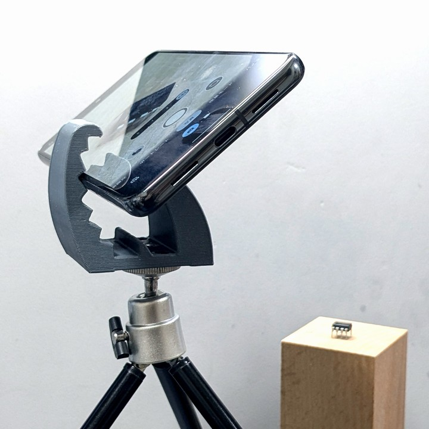

# 作業自撮り用スマホスタンド

小物や手元の作業を撮りたいけど三脚を用意するほどでもないようなときに気軽に使えるスマホスタンドです。

- スマホを7種類の角度で固定できます。
- 底面に 1/4-20 UNC のネジ穴があり、三脚等の雲台に固定できます。

## ライセンス

[CC BY-NC-SA](./LICENSE)

## 改版履歴

|リビジョン|説明|
|:--:|:--|
|r1|初版公開|
|r2|安定性の改善、雲台への取り付け対応|

## 

## ギャラリー

    
